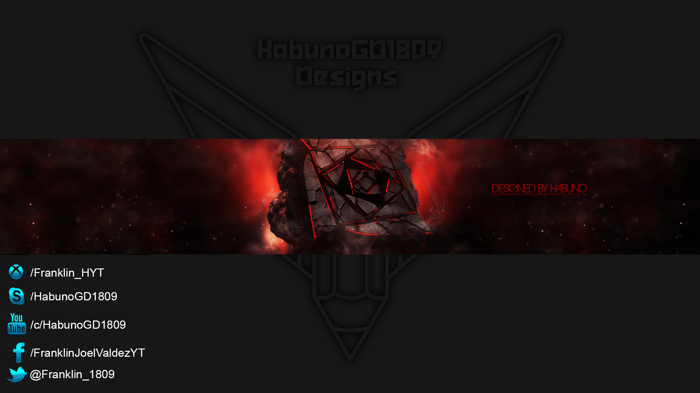

<h1 align="center">Welcome to my profile. I'm - Franklin J. </h1>

<table align="right">
<tr>
<td>

[][youtube]
[][twitter]
[][instagram]
[][facebook]

</td>
</tr>
</table>

  
 About me!

### Love 💻!!
- 👋 Hi, I’m Franklin J. Valdez
- 👀 I’m interested in creating quality software
- 🌱 I’m currently learning software development...
- 💞️ I’m looking to collaborate in open source projects
- 📫 How to reach me 🙉😁

 

---

<h3 align="center"> Latest Projects</h3>

<tr>
<td>

</td>

<td> 

<h4 align="left"> <a href="https://github.com/HabunoGD1809/gm" target="_blank"><code>GitManager</code></a> </h4>

  

    
see more...

    working on this...

  
 </td>
</tr>
<tr>
<td>

</td>

<td> <h4 align="left"> <a href="" target="_blank"><code>Reddit</code></a> </h4>
  

    
see more...

    working on this...

  
 </td>
</tr>

</td>
<td> <h4 align="left"> <a href="https://github.com/HabunoGD1809/vimtools" target="_blank"><code>vimtools</code></a> </h4>
  

    
see more...

    working on this...

  
 </td>

 
 

---

<h3 align="center">Languages and Tools</h3>

  &nbsp;
  &nbsp;
  &nbsp;
  &nbsp;
  &nbsp;  
  &nbsp;
  &nbsp;
  &nbsp;
  &nbsp;
  &nbsp;
  &nbsp;  
  &nbsp;
  &nbsp;  
  &nbsp;   

---

<h3 align="left"> Latest Videos</h3>

<!-- YOUTUBE:START -->
- [PRYECTO FINAL  --- INTRODUCCION A LA PROGRAMACION](https://www.youtube.com/watch?v=8AGWv4lWGaw)
- [API GET C# RNC EXAMEN_1](https://www.youtube.com/watch?v=pCFLl-68SQg)
- [HIPOTENUSA TRIANGULO RECTANGULO C# 10.](https://www.youtube.com/watch?v=0ntkPUXTqqo)
<!-- [AuronPlay invita a Nate Gentile a jugar AMONG US y le dice que &quot;LO QUIERE&quot;](https://www.youtube.com/watch?v=HqiQqMi5_pU)
- [ROCKET LEAGUE &lpar;MEMES RECOPILACIÓN&rpar;](https://www.youtube.com/watch?v=wagMfhZFYSg) -->
<!-- YOUTUBE:END --> 

 [More videos...](https://www.youtube.com/@HabunoGD1821/videos)

---

<h3 align="left"> GitHub Stats</h3>

  <a href="https://github.com/HabunoGD1809">
  
  

---

### 🏆 GitHub Profile Trophy

[twitter]: https://twitter.com/franklin_1809
[youtube]: https://www.youtube.com/c/HabunoGD1809
[instagram]: https://www.instagram.com/habuno_0fj/
[facebook]: https://www.facebook.com/HabunoGD1809YT/

https://user-images.githubusercontent.com/73097560/115834477-dbab4500-a447-11eb-908a-139a6edaec5c.gif

